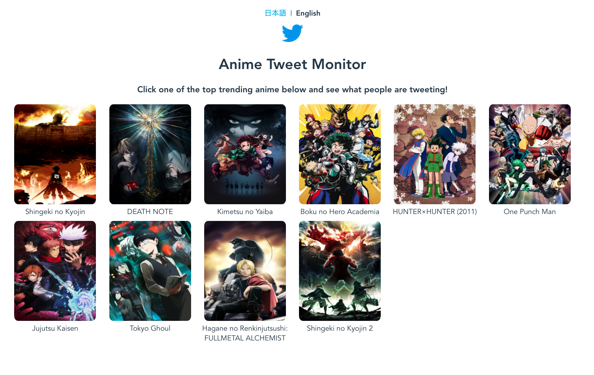
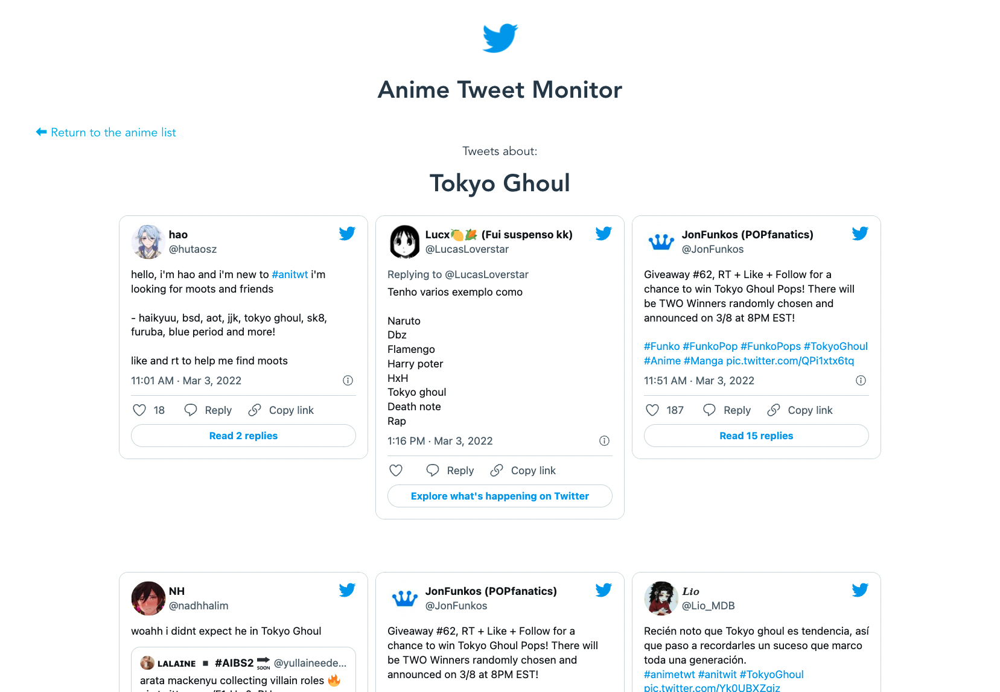

# Anime Tweet Monitor

This is a small application to get recent Tweets about trending anime shows.

## How the application works

This application shows a list of currently trending anime shows retrieved from the [AniList API v2](https://anilist.gitbook.io/anilist-apiv2-docs/).
The user can select a preferred language (English or Japanese) at the top of the screen.



When a user clicks on one of the shows displayed on the UI, the screen will switch to a list of Tweets about the anime selected, retrieved from [Twitter API v2](https://developer.twitter.com/en/docs/twitter-api).



To return to the anime panel page, click *Return to the anime list* (or *アニメリストに戻る* in the Japanese UI).

## Technologies used

This application mainly runs on these technologies:

- [Twitter API v2](https://developer.twitter.com/en/docs/twitter-api) for fetching Tweets.
- [AniList API v2](https://anilist.gitbook.io/anilist-apiv2-docs/) for fetching anime data.
- [Vue.js](https://vuejs.org/) and their related libraries ([vue-spinner](https://github.com/greyby/vue-spinner) and [vue-i18n](https://github.com/kazupon/vue-i18n)) for application frontend.
- [Node.js](https://nodejs.org/en/) and [Express.js](https://expressjs.com/) for application backend.
- [axios](https://github.com/axios/axios) for handling request sending.

## What you need to run this application

- [Node.js](https://nodejs.org/en/) version 16.0 or above and [npm](https://www.npmjs.com/).
- A [Twitter Developer Account](https://developer.twitter.com/en/portal/petition/essential/basic-info). Your account needs to be approved.

## How to run the application

1. Create a new project in the [Twitter Developer Portal](https://developer.twitter.com/en/portal/dashboard), if you haven't done so yet. Give it a name, select the use case and a project description.

2. Create a new [Twitter App](https://developer.twitter.com/en/docs/apps/overview) within the Twitter Developer Portal. Once you finish creating the app, you'll be provided with your API Key, API Key Secret and the Bearer Token. Take a note of these credentials.

:warning: These credentials will only be displayed once. Ensure to save them in a secure location.

3. Move into the project's root directory in your terminal.

4. Create a `.env` file in the root directory and paste this code:

```
TWITTER_API_BEARER_TOKEN=XXXXX
```

Replace `XXXXX` with the Bearer Token you saved in step 2, and save the file.

:warning: Do not push `.env` to git. It's recommended that you include `.env` in your `.gitignore` file.

5. Install the required dependencies. Execute this command in the root directory:

```bash
npm install
```

6. Start the Node.js server. Execute this command in the root directory:

```bash
node server.js
```

7. Serve the frontend. Open another window in the terminal, move into the project's root directory, and execute this command:

```bash
npm run serve
```

8. Access the application in the browser. Open a browser window and access [http://localhost:8080/](http://localhost:8080/).